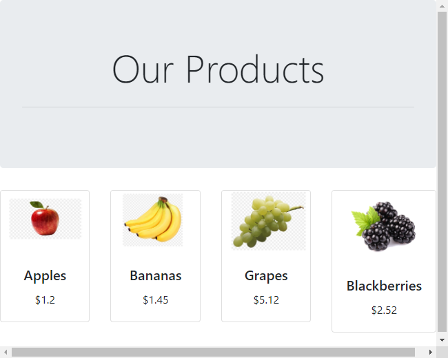

# Creating a REST API with Flask
## Requirements
1. [Python](https://www.python.org/downloads/)
3. [Visual Code](https://code.visualstudio.com/download)

## Creating virtual environment
1. Create a folder for this application and then open this folder in the terminal. 
2. Create a virtual environment with **`python -m venv <name>`** .
3. Activate the virtual environment with: **`<name>\Scripts\activate`**.
4. Install Flask and CORS with **`pip install Flask flask_cors`**
5. To get the installed packages and its dependencies installed inside the virtual environment use **`pip list`**.
6. Also check the site-packages folder.
   > *Linux*:  ./virtual-environment-name>/lib/python<python-version>/site-packages
   >
   > *Windows*: .<virtual-environment-name>\lib\site-packages

## Creating application files
1. In the same terminal type **`code .`** to open the current directory in Visual Code.
2. In Visual Code, right click on left panel and select `New File`, change the name of the file to `app.py`.
3. Copy the following code in `app.py`:
    ```python
    #import modules section
    from flask import Flask
    import os

    app = Flask(__name__)

    #variables section

    #routes section
    @app.route("/")
    def hello():
        return "Hello World from Flask!"

    #main function
    if __name__ == '__main__':
        port= os.environ.get('PORT')
        app.run(host='0.0.0.0', debug=False, port=port)
    ```
4. Run the application with **`python app.py`**, open your browser on this page `http://localhost:5000/`. The default port for Flask it is 5000 but this can be changed.
5. Add new modules (**request** and **jsonify**) in the import section as followed:
    ```python
    #import modules section
    from flask import Flask, request, jsonify
    ```
6. Add an array of products right after the app instance as followed:
    ```python
    app = Flask(__name__)

    #variables section
    products = [
            {
                'id': 0,
                'title': 'Apples',
                'price': 1.20
            },
            {
                'id': 1,
                'title': 'Bananas',
                'price': 1.45
            },
            {
                'id': 2,
                'title': 'Grapes',
                'price': 5.12
            },
            {
                'id': 3,
                'title': 'Blackberries',
                'price': 2.52
            },
        ]
    ```
7. Replace the route "/" with the following code: 
    ```python
    #routes section
    @app.route('/', methods=['GET'])
    def home():
        return '''<h1>Products API</h1>'''
    ```
   >Note: You can add http verbs methods (GET, POST, PUT, PATCH, etc) to each route.
8. Add the following missing routes:
    ```python
    @app.route('/api/products/all', methods=['GET'])
    def get_products():
        return jsonify(products)

    @app.route('/api/products', methods=['GET'])
    def get_products_byid():
        if 'id' in request.args:
            id = int(request.args['id'])
        else:
            return "Please specify a product id."

        results=[]    

        for product in products:
            if product['id'] == id:
                results.append(product)

        return jsonify(results)
    ```
9. Add CORS after the app instance.
    ```python
    app = Flask(__name__)

    cors = CORS(app)
    ```
10. Final structure will be like this: 
    ```python
    #import modules section
    from flask import Flask, request, jsonify
    import os

    app = Flask(__name__)

    #variables section
    products = [
            {
                'id': 0,
                'title': 'Apples',
                'price': 1.20
            },
            {
                'id': 1,
                'title': 'Bananas',
                'price': 1.45
            },
            {
                'id': 2,
                'title': 'Grapes',
                'price': 5.12
            },
            {
                'id': 3,
                'title': 'Blackberries',
                'price': 2.52
            },
        ]

    #routes section
    @app.route('/', methods=['GET'])
    def home():
        return '''<h1>Products API</h1>'''

    @app.route('/api/products/all', methods=['GET'])
    def get_products():
        return jsonify(products)

    @app.route('/api/products', methods=['GET'])
    def get_products_byid():
        if 'id' in request.args:
            id = int(request.args['id'])
        else:
            return "Please specify a product id."

        results=[]    

        for product in products:
            if product['id'] == id:
                results.append(product)

        return jsonify(results)

    #main function
    if __name__ == '__main__':
        port= os.environ.get('PORT')
        app.run(host='0.0.0.0', debug=False, port=port)
    ```
 
    Start the application with **`python app.py`**, open your browser on this page `http://localhost:5000/`
11. Test the following endpoints:
    - http://localhost:5000/api/products/all
    - http://localhost:5000/api/products?id=<number>
    - http://localhost:5000/api/products

## Implementing Template Engine
1. Install Jinga2 library with  **`pip install Jinja2`** with virtual environment activated.
2. Import the module **`render_template`** in the first line as followed:
    ```python
    #import modules section
    from flask import Flask, request, jsonify, render_template
    ```
3. Flask will search all the templates files inside **templates** folder by default. In Visual Code, create a new folder named **templates** in the project root directory and create a **index.html** file inside that folder.
4. Replace the route **"/"** with the following code:
    ```python
    @app.route('/', methods=['GET'])
    def home():
        return render_template('index.html',title="Products", products=products)
    ```
4. Download the **static** folder located inside **python-training-resources/ui/flask/** from the following github repository: https://github.com/azureossd/python-training-resources, you can clone it or download it as zip file.
5. Copy the **static** folder to your project root directory.This project contains two folders:
	- css – bootstrap.min.css (Cascading Style Sheet)
	- images – some images for the project.

6. Open **index.html** file and add the following content:
    ```html
    </html>
        <head>
            <title>{{ title }}</title>
            <link href="/static/css/bootstrap.min.css" rel="stylesheet">
        </head>
        <body>
            <div class="jumbotron">
                <h1 class="display-4 text-center">Our Products</h1>
                <hr class="my-4">
            </div>
            <div class="row row-cols-1 row-cols-md-3">
                
                <div class="col mb-4">
                <div class="card">
                    
                    <div class="card-body">
                    <h5 class="card-title text-center">{{ product.title }}</h5>
                    <p class="card-text text-center"><span>$</span>{{ product.price }}</p>
                    </div>
                </div>
                </div>
                
            </div> 
        </body>
    </html>
    ```
7. Start the application with **`python app.py`**, open your browser on this page `http://localhost:5000/`

   >Note: To deactivate the virtual environment you can run `deactivate`.

## Final Result

   
